<div align="center">



<br/>


</div>

<br/>

```
jake@lovelock ~ % whoami
curious_by_nature
```

- 🔭 Currently building **[PetPortal](https://getpetportal.com)** — a SaaS management platform for pet boarding businesses
- 🌱 Currently learning **Cyber Security** — working through the Google Cybersecurity Professional Certificate
- 👨‍💻 All of my projects live at **[jakelovelock.com](https://jakelovelock.com)**
- 📝 I write on **[Medium](https://medium.com/@jakeIovelock)**
- 📄 My full experience is at **[jakelovelock.com/resume](https://jakelovelock.com/resume)**
- 📫 Reach me at **hello@jakelovelock.com**
- ⚡ Fun fact: **I think I'm funny**

<br/>

<div align="center">

### Connect with me

<a href="https://linkedin.com/in/jakelovelock" target="_blank"></a>
<a href="https://www.behance.net/jakelovelock" target="_blank"></a>
<a href="https://medium.com/@jakeIovelock" target="_blank"></a>
<a href="https://dev.to/l0vel0ck" target="_blank"></a>
<a href="mailto:hello@jakelovelock.com"></a>

</div>

<br/>

<div align="center">

### Expertise

</div>

<div align="center">

**Development**
<br/>


<br/><br/>

**Cyber Security**
<br/>


<br/><br/>

**Design**
<br/>


<br/><br/>

**Tools**
<br/>


</div>

<br/>

<div align="center">


</div>

<br/>

<div align="center">

<sub>Build it. `[ break it ]`</sub>

</div>
